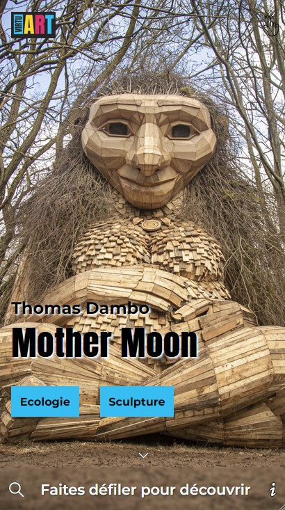
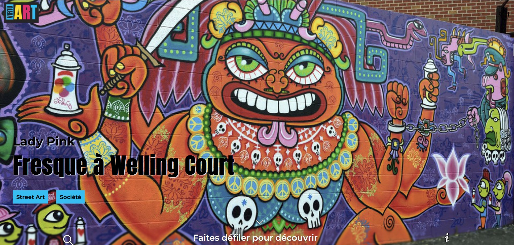
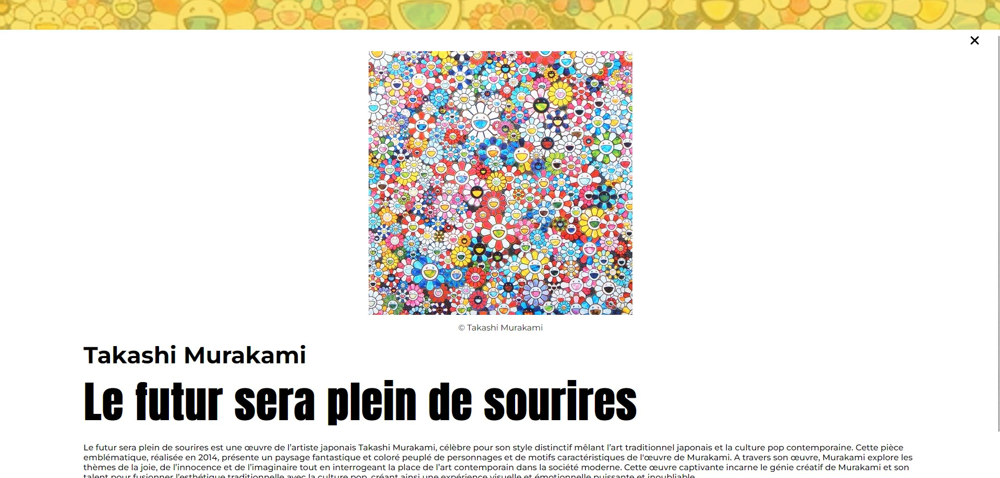

<h1 align="center"> 🖼️ Bienvenue chez Virtu'Art! 🖼️ </h1>

 

# 📄 A propos :

Plongez dans un monde où l'art rencontre la technologie avec Virtu'Art. Cette galerie d'art virtuelle offre une expérience immersive unique, où vous pouvez explorer des œuvres d'art exceptionnelles sans quitter le confort de votre maison. 

 🎨 Virtu'Art : l'innovation au service de l'émotion, sans quitter votre maison ! 🎨 

# 👩🏽‍💻 Découvrez le site :
[Site de Virtu'Art](https://github.com/fanny-pretre/art-galery-2/deployments/github-pages)

# 🎨 Design (maquettes):

<h2> Téléphone </h2>

<h2> Desktop </h2>

# 💻 Stack Technique:

# ©️ Remerciements :

Virtu'Art est un prototype de site web créé par une équipe de quatre étudiants de la Wild Code School :

- [Fanny Prêtre](https://www.linkedin.com/in/fanny-pr%C3%AAtre/)
- [Simon Bescheron](https://www.linkedin.com/in/simon-bescheron/)
- [David Lanzetti](https://www.linkedin.com/in/david-lanzetti/?originalSubdomain=fr)
- [Nicolas Loza](https://github.com/Nicolas4Loza/)

Remerciements particuliers à notre instructeur et mentor ([Anthony Gorski](https://fr.linkedin.com/in/anthony-gorski) de la Wild Code School pour ses conseils et son soutien tout au long du processus de développement.
 
 
 
 
